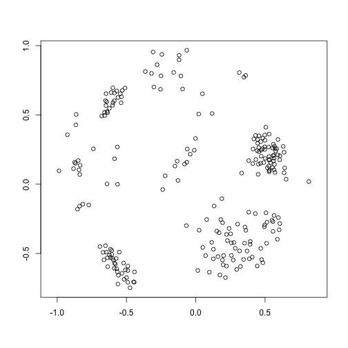
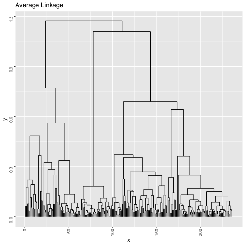
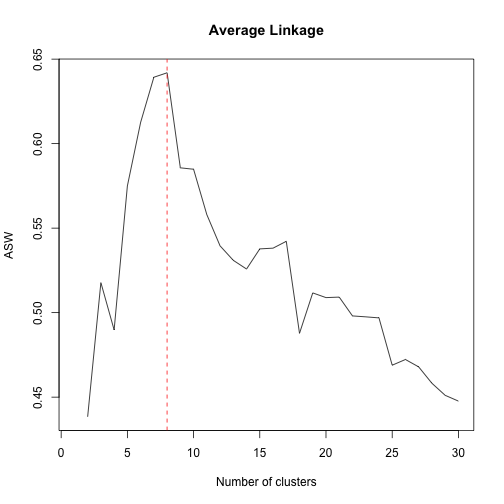
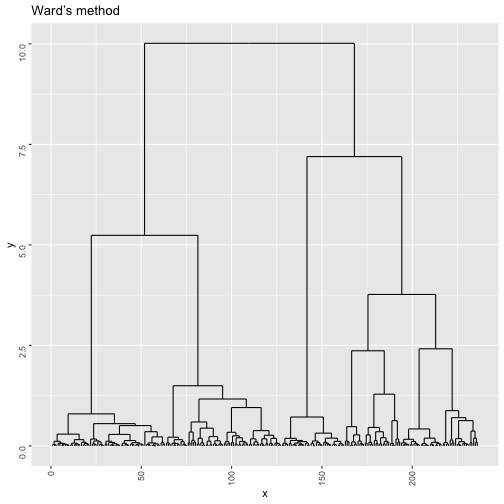
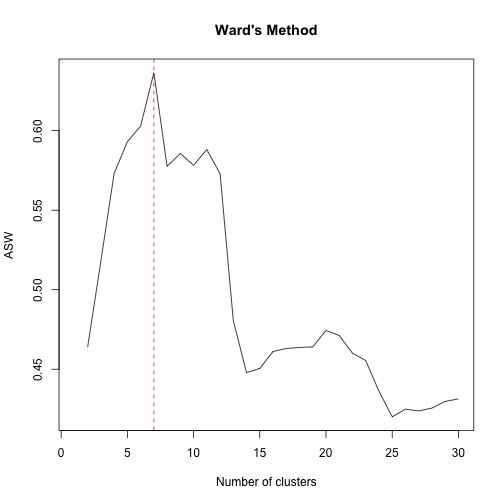
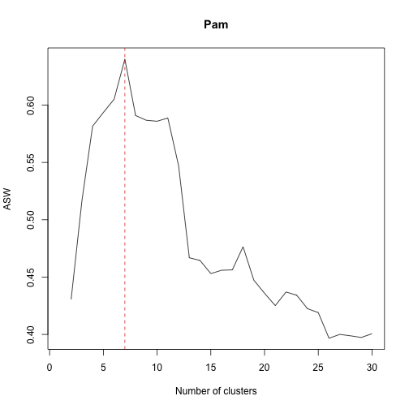
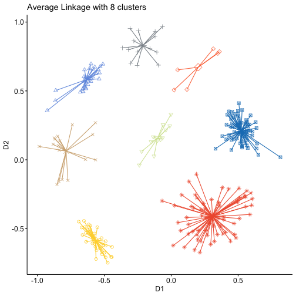
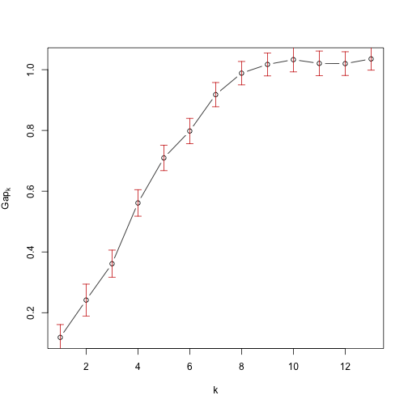
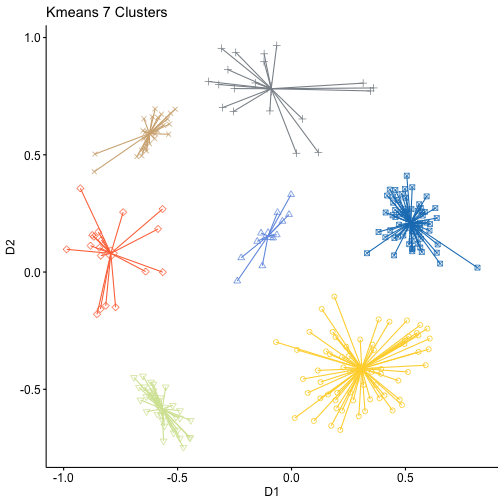

# Exercise 1


## a)

```r
data(tetragonula)

ta <- alleleconvert(strmatrix=tetragonula)
tai <- alleleinit(allelematrix=ta)

mdstai=mds(tai$distmat)


plot(mdstai$conf, xlab = "", ylab = "", asp = 1)
```




For this exercises I used the distances computed on the points generated by the MDS to do a better comparison with the following exercise. In a normal situation I would have used the matrix of genetic distances


## Average Linkage

```r
clustb <- hclust(dist(mdstai$conf),method="average")
b=ggdendrogram(clustb, rotate = F, theme_dendro = F,labels = F)
print(b + ggtitle("Average Linkage"))
```



```r
tasw <- NA
tclusk <- list()
tsil <- list()
for (k in 2:30){
  tclusk[[k]] <- cutree(clustb,k)
  tsil[[k]] <- silhouette(tclusk[[k]],dist=dist(mdstai$conf))
  tasw[k] <- summary(silhouette(tclusk[[k]],dist=dist(mdstai$conf)))$avg.width
}
plot(1:30,tasw,type="l",xlab="Number of clusters",ylab="ASW", main="Average Linkage")
m=match(max(tasw[-1]),tasw[-1])+1
abline(v=m,col="red",lty="dashed")
```




As we can see the suggested number of clusters is 8


# Ward's Method

```r
wclust <- hclust(dist(mdstai$conf),method="ward.D2")
w=ggdendrogram(wclust, rotate = F, theme_dendro = F,labels = F)
print(w + ggtitle("Ward’s method"))
```



```r
tasw <- NA
tclusk <- list()
tsil <- list()
for (k in 2:30){
  tclusk[[k]] <- cutree(wclust,k)
  tsil[[k]] <- silhouette(tclusk[[k]],dist=dist(mdstai$conf))
  tasw[k] <- summary(silhouette(tclusk[[k]],dist=dist(mdstai$conf)))$avg.width
}
plot(1:30,tasw,type="l",xlab="Number of clusters",ylab="ASW",main="Ward's Method")
m=match(max(tasw[-1]),tasw[-1])+1
abline(v=m,col="red",lty="dashed")
```




As we can see the suggested number of clusters is 7


## Pam

```r
pasw <- NA
pclusk <- list()
psil <- list()
for (k in 2:30){
  pclusk[[k]] <- pam(dist(mdstai$conf),k)
  # Computation of silhouettes:
  psil[[k]] <- silhouette(pclusk[[k]],dist=dist(mdstai$conf))
  # ASW needs to be extracted:
  pasw[k] <- summary(psil[[k]])$avg.width
}


plot(1:30,pasw,type="l",xlab="Number of clusters",ylab="ASW",main="Pam")
m=match(max(pasw[-1]),pasw[-1])+1
abline(v=m,col="red",lty="dashed")
```




As we can see the suggested number of clusters is 8


```r
sil<- matrix(0, nrow = 1, ncol = 3)

colnames(sil)=c("Average","Ward","Pam")
rownames(sil)=c("ASW")
sil[1,]=c( 0.6419136,0.6363861,0.6401453)
sil
```

```
##       Average      Ward       Pam
## ASW 0.6419136 0.6363861 0.6401453
```


The highest value for is ASW is offered by Aveage linkage with 8 clusters, so I opted for this method.


```r
mdstai.df=as.data.frame(mdstai$conf)
clustb10=cutree(clustb,8)

clustb10f=as.factor(clustb10)

mdstai.df= cbind(mdstai.df,clustb10f)

gg1=ggscatter( mdstai.df,
               x="D1", y="D2",
               color = "clustb10f", palette = "simpsons",
               shape = "clustb10f",
               ellipse = F, 
               mean.point = TRUE,
               star.plot = TRUE)
gg1+theme(legend.position = "none")+ggtitle("Average Linkage with 8 clusters")
```



# b)

```r
cg1 <- clusGap(mdstai$conf,kmeans,13,B=100,d.power=2,spaceH0="scaledPCA",nstart=100)
```

```
## Clustering k = 1,2,..., K.max (= 13): .. done
## Bootstrapping, b = 1,2,..., B (= 100)  [one "." per sample]:
## .................................................. 50 
## .........................
```

```
## Warning: did not converge in 10 iterations
```

```
## ......................... 100
```

```r
plot(cg1,main="")
```



```r
b=print(cg1,method="Tibs2001SEmax",SE.factor=2)
```

```
## Clustering Gap statistic ["clusGap"] from call:
## clusGap(x = mdstai$conf, FUNcluster = kmeans, K.max = 13, B = 100,     d.power = 2, spaceH0 = "scaledPCA", nstart = 100)
## B=100 simulated reference sets, k = 1..13; spaceH0="scaledPCA"
##  --> Number of clusters (method 'Tibs2001SEmax', SE.factor=2): 7
##            logW   E.logW       gap     SE.sim
##  [1,] 4.0022215 4.120870 0.1186486 0.04227843
##  [2,] 3.3679534 3.609483 0.2415292 0.05252593
##  [3,] 2.7732498 3.134459 0.3612093 0.04485499
##  [4,] 2.1526272 2.713858 0.5612306 0.04357457
##  [5,] 1.8003177 2.509855 0.7095375 0.04182651
##  [6,] 1.5158069 2.313790 0.7979829 0.04162255
##  [7,] 1.2160338 2.133873 0.9178394 0.03987527
##  [8,] 0.9815963 1.970144 0.9885474 0.03848105
##  [9,] 0.8133341 1.830623 1.0172891 0.03772344
## [10,] 0.6778002 1.710782 1.0329813 0.04013155
## [11,] 0.5806698 1.601325 1.0206549 0.04057282
## [12,] 0.4771784 1.497111 1.0199325 0.03909452
## [13,] 0.3640966 1.399467 1.0353706 0.03687262
```


The suggested number of clusters suggested by "Tibs2001SEmax" is 7


```r
kmeans=kmeans(mdstai$conf,7,nstart=100)
km=as.factor(kmeans$cluster)

mdstai.df= cbind(mdstai.df,km)
gg1=ggscatter( mdstai.df,
               x="D1", y="D2",
               color = "km", palette = "simpsons",
               shape = "km",
               ellipse = F, 
               mean.point = TRUE,
               star.plot = TRUE)
gg1+theme(legend.position = "none")+ggtitle("Kmeans 7 Clusters")
```



```r
adjustedRandIndex(kmeans$cluster,clustb10)
```

```
## [1] 0.9851412
```


In this case it's very hard to tell wich one of the two solutions is better, they look identical and this is confirmed by an ARI almost equal to 1. More generarly we can say that kmeans is less computational demanding but its performance depends on the validity of the assumptions at its base. The results also depend on on the starting centroids, so we can say that it's affected by randomness and we get a local optimum not a global one. One crucial point is also the choice of k that happens before the algorithm is computed, not after like in the case of hierarchical clustering, so the results are affected also by this. Hierarchical clustering is also more flexible because it useses dissimilarities, so we can include also cathegorical variables. 

I don't think that in this case it would be better to consider p>2 because the clusters can be identified pretty clearly using the graphical reprsentation.

